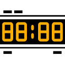
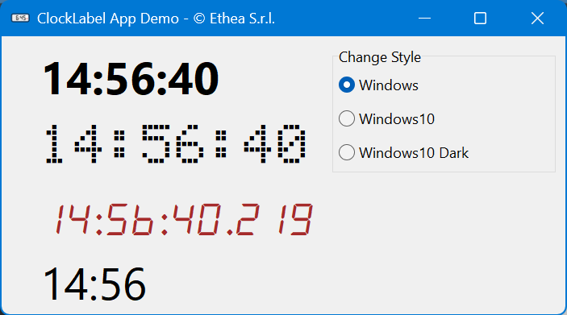
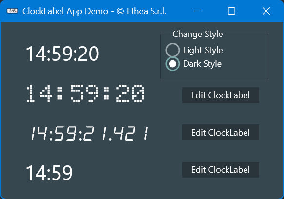
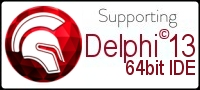

# DelphiComponentsTutorial [](https://opensource.org/licenses/Apache-2.0)
---

Examples of Delphi Components for VCL and FMX, used for Tutorial Speech at ITDevCon 2025 in Milan (Italy).

# Example Component:

## TClockLabel

A simple Clock based built with a TLabel and a TTimer (VCL and FMX Versions).



VCL Demo:



FMX Demo:



### Features:

* Custom Font (DotMatrix or AlarmClock)
* Custom DisplayFormat (CustomClock, ClassicClock, HourMinutesClock, MillisecondsClock)

### Source Details:

```Pascal

type
  TClockLabelType = (ctCustomClock, ctClassicClock, ctHourMinutesClock, ctMillisecondsClock);
  TSpecialFont = (sfOther, sfDotMatrix, sfAlarmClock);

const
  SpecialFontNames : Array[TSpecialFont] of string =
    ('Other Font', '5x7 DOT Matrix', 'alarm clock');

    //TClockLabel Properties
    property ClockType: TClockLabelType read FClockLabelType write SetClockLabelType default ctClassicClock;
    property DisplayFormat: string read FDisplayFormat write SetDisplayFormat stored StoreDisplayFormat;
    property SpecialFont: TSpecialFont read FSpecialFont write SetSpecialFont default sfOther;
    property TimerInterval: Cardinal read GetInterval write SetInterval default 1000;

    //TClockLabel Event-handlers
    property OnChange: TNotifyEvent read FOnChange write FOnChange;

```
### Available for Delphi 12 and Delphi 13 (VCL 32bit and 64bit platforms)



Author: Carlo Barazzetta

Copyright © Ethea S.r.l.

